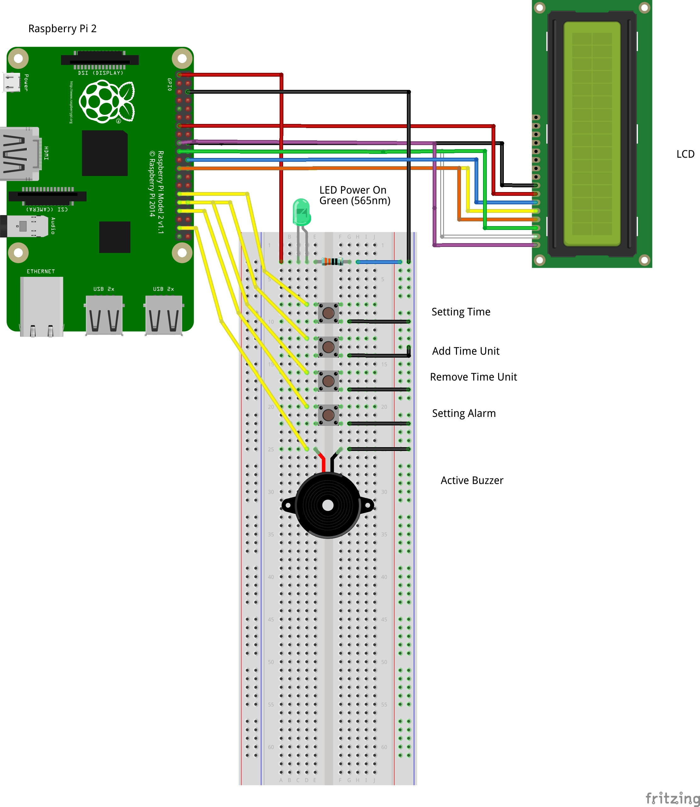

# Personal clock alarm with a Raspberry Pi

The goal of this project is to provide the code and the documentation to build a
personal clock alarm using a Raspberry Pi.
The clock alarm must be able to :

-   [ ] Display the time;
-   [ ] Change the time displayed;
-   [ ] Set an alarm;
-   [ ] Ring on time;
-   [ ] *(Optional)* Download and play a podcast for the alarm.

## HardWare

### List

- Raspberry Pi 2 x1
- Breadboard x1
- Green Led x1
- Push Buttons x4
- Active Buzzer x1
- LCD Screen x1

### Wiring scheme

## Software

### Behavior

The setting time button must have the following behavior :

- After being pushed 3s, the time setting is enabled for the hours;
- After pushing another time, the time setting is now enabled for the minutes;
- After pushing a third and last time, the time is set.

